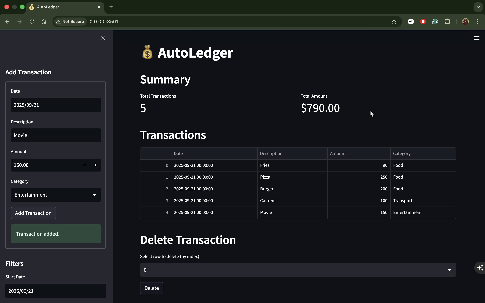
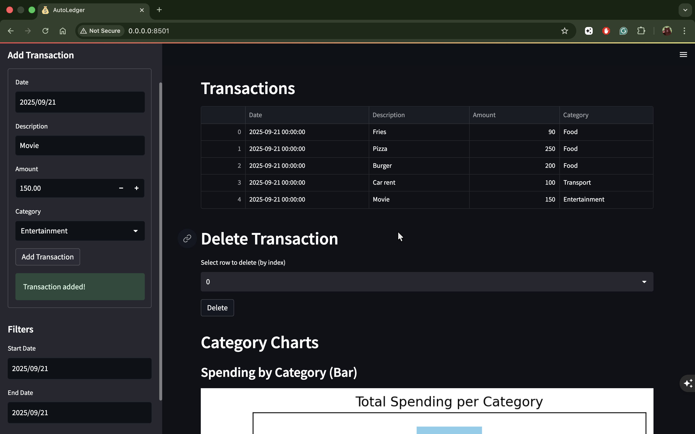
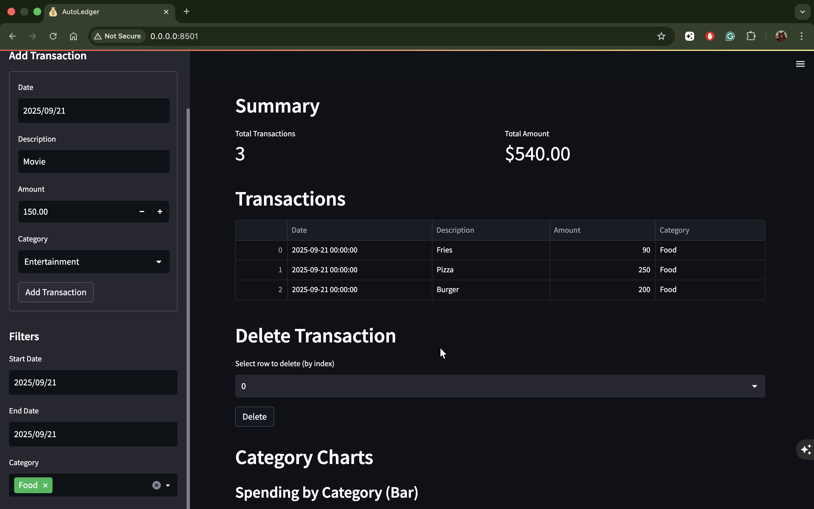
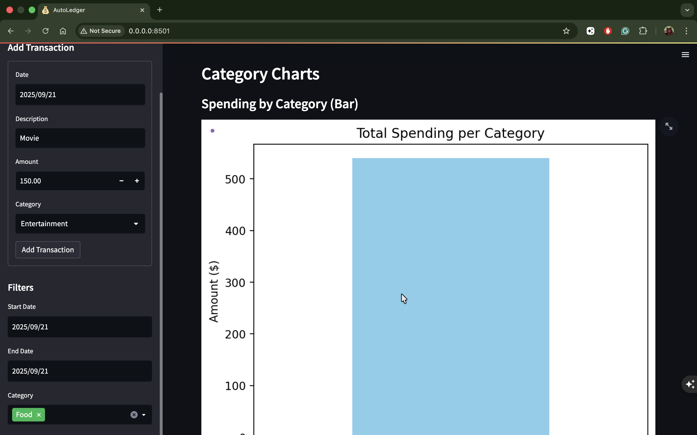

# 💰 AutoLedger
_Track every transaction, master your finances 🧾_

AutoLedger is a lightweight, dark-mode financial tracker built with **Streamlit** and fully Dockerized. Easily add, delete, filter, and visualize your transactions, while exporting your data for backup or analysis.

---

## Features

- **Sleek Dark Mode:** Modern interface optimized for readability  
- **Add Transactions:** Record date, description, amount, and category  
- **Delete Transactions:** Remove incorrect entries easily  
- **Filter Transactions:** Filter by date range and category  
- **Summary Metrics:** Quick overview of total transactions and total amounts  
- **Monthly Summary & Charts:** Bar and pie charts for spending trends and category analysis  
- **Export Data:** Download filtered transactions to CSV or Excel  
- **Auto-Backup:** Transactions are backed up automatically

---

## Screenshots

### Dashboard Overview

### Add Transaction

### Filter & Summary

### Category Chart

> ⚠️ Replace placeholders with actual screenshots from your app for best presentation.

---

## Installation & Running

### Prerequisites
- **Docker** installed ([https://www.docker.com/get-started](https://www.docker.com/get-started))  
- Optional: **Python 3.10+** if you want to run locally without Docker  

---

### 1️⃣ Run via Docker (Recommended)

**Step 1: Clone the repository**
bash
git clone https://github.com/urstrulyshakil/AutoLedger.git
cd AutoLedger

**Step 2: Build & Run the Docker container (Easy command)**
run_autoledger
This alias builds the Docker image, removes any existing container, and runs a new container mapping the project folder for persistent data.

**Step 3: Access the app**
Open your browser at: http://localhost:8501
⚠️ All transaction data is saved locally in your project folder (transactions.csv and transactions_backup.csv).

### 2️⃣ Run Locally without Docker (Optional)

**Step 1: Create a virtual environment**
python3 -m venv venv
source venv/bin/activate   # macOS/Linux
venv\Scripts\activate      # Windows

**Step 2: Install dependencies**
pip install -r requirements.txt

**Step 3: Run the app**
streamlit run app/main.py

**Step 4: Open the app**
	•	Visit: http://localhost:8501
⚠️ Make sure you are in the project root directory when running the app.

### 3️⃣ Quick Docker Commands (Aliases)

You can add these aliases to your terminal session (~/.bashrc or ~/.zshrc) for easy management:
# Build & run the AutoLedger container
alias run_autoledger="docker build -t autoledger-dark:latest . && docker rm -f autoledger_dark 2>/dev/null || true && docker run -d -p 8501:8501 --name autoledger_dark -v $(pwd):/app autoledger-dark:latest"

# Stop the running AutoLedger container
alias stop_autoledger="docker stop autoledger_dark"

# Restart the AutoLedger container
alias restart_autoledger="docker restart autoledger_dark"

How to use:
run_autoledger      # Build & start the app
stop_autoledger     # Stop the container
restart_autoledger  # Restart the container

### Tech Stack
	•	Python 3.10
	•	Streamlit 1.22.0
	•	Pandas, Matplotlib, Openpyxl
	•	Docker for containerization

